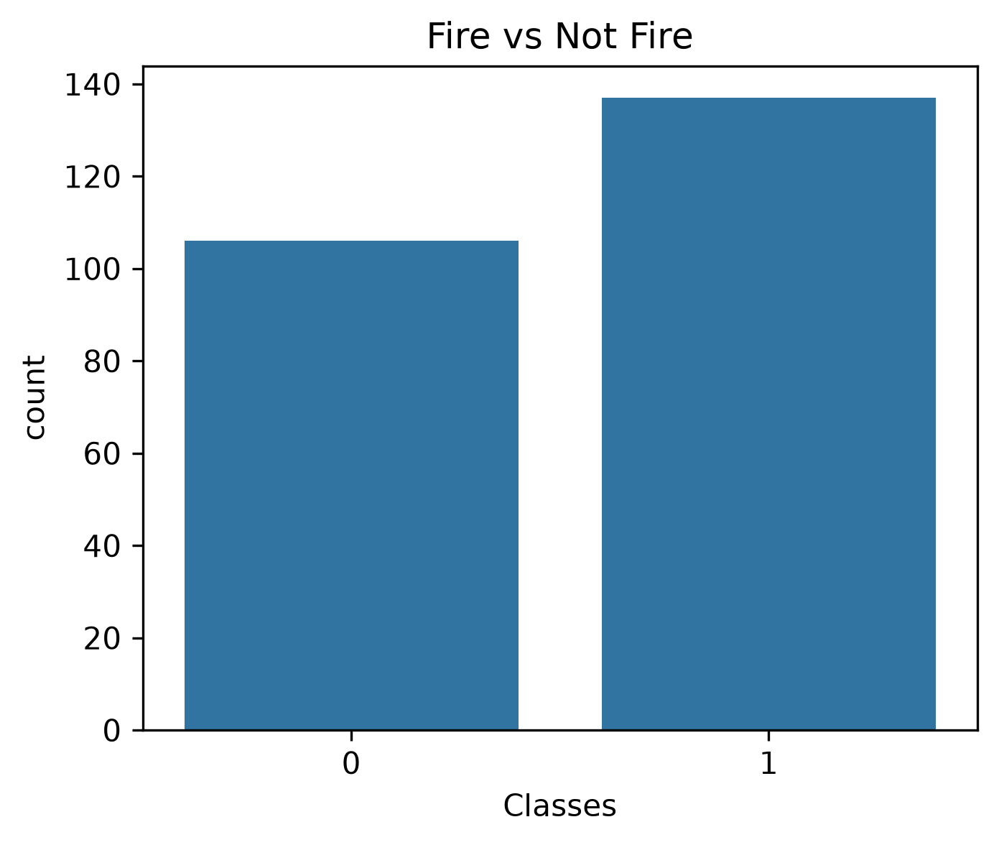
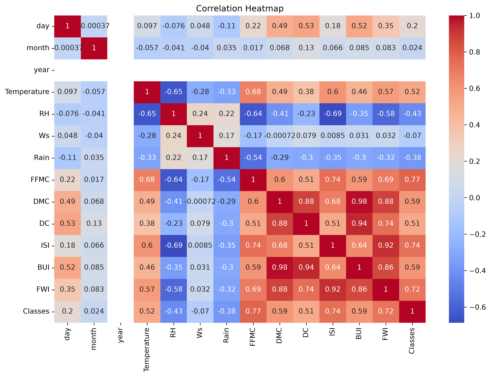
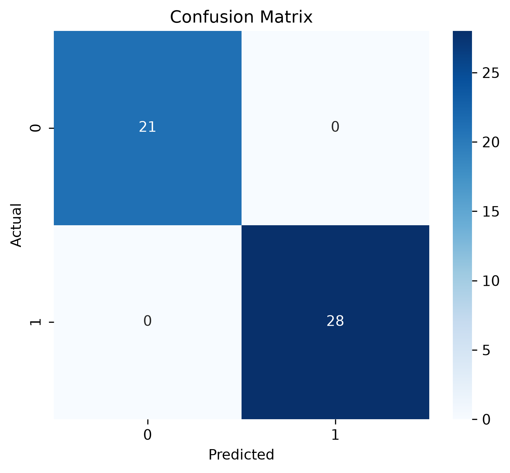
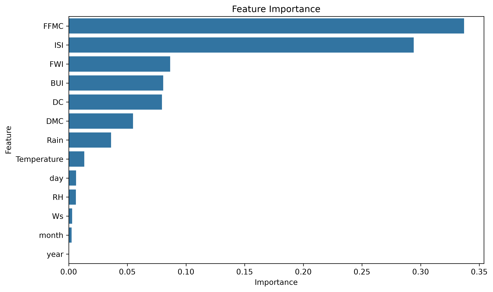

# 🔥 Forest Fire Prediction Using Random Forest

A Machine Learning project that predicts the occurrence of forest fires using the **Random Forest Classifier**. The project includes data preprocessing, exploratory data analysis (EDA), model training, evaluation, feature importance analysis, and prediction.

---

# 📌 Overview

Forest fires can cause significant environmental and economic damage. This project uses the **Algerian Forest Fires Dataset** to build a classification model capable of predicting whether a fire is likely to occur based on weather and Fire Weather Index (FWI) parameters.

---

# 📸 Project Screenshots

## 🔥 Fire vs Not Fire Distribution



---

## 📊 Correlation Heatmap



---

## 📉 Confusion Matrix



---

## 📈 Feature Importance



---

# 🚀 Features

- ✅ Data Cleaning & Preprocessing
- ✅ Exploratory Data Analysis (EDA)
- ✅ Fire vs Not Fire Classification
- ✅ Random Forest Classifier
- ✅ Feature Importance Analysis
- ✅ Confusion Matrix Visualization
- ✅ Classification Report
- ✅ Model Saving using Pickle
- ✅ Prediction Output CSV Generation

---

# 📂 Dataset

**Dataset:** Algerian Forest Fires Dataset

The dataset contains weather observations and Fire Weather Index (FWI) measurements collected from two regions of Algeria.

**Target Classes**

- 🔥 Fire
- 🌳 Not Fire

---

# 🛠 Technologies Used

- Python
- Pandas
- NumPy
- Matplotlib
- Seaborn
- Scikit-learn
- Pickle

---

# 🤖 Machine Learning Model

**Algorithm Used**

- Random Forest Classifier

---

# 📊 Model Evaluation

The model was evaluated using:

- Accuracy Score
- Classification Report
- Confusion Matrix

---

# 📁 Project Structure

```text
Forest-Fire-Prediction-Using-Random-Forest/
│
├── dataset/
│   └── Algerian_forest_fires_dataset.csv
│
├── forest_fire_prediction.py
├── random_forest_model.pkl
├── Forest_Fire_Output.csv
├── fire_distribution.png
├── correlation_heatmap.png
├── confusion.png
├── feature_importance.png
└── README.md
```

---

# ▶️ How to Run

### 1. Clone Repository

```bash
git clone https://github.com/Itsjanvi/Forest-Fire-Prediction-Using-Random-Forest.git
```

### 2. Install Dependencies

```bash
pip install pandas numpy matplotlib seaborn scikit-learn
```

### 3. Run the Project

```bash
python forest_fire_prediction.py
```

---

# 📤 Output

The project generates:

- ✅ Trained Random Forest Model (`random_forest_model.pkl`)
- ✅ Prediction Output CSV (`Forest_Fire_Output.csv`)
- ✅ Fire Distribution Graph
- ✅ Correlation Heatmap
- ✅ Confusion Matrix
- ✅ Feature Importance Graph

---

# 🔮 Future Improvements

- Hyperparameter Tuning
- Cross Validation
- Streamlit Web Application
- Real-Time Forest Fire Prediction
- Cloud Deployment

---

# 👩‍💻 Author


**Janvi**

If you found this project helpful, consider giving this repository a ⭐ on GitHub!
